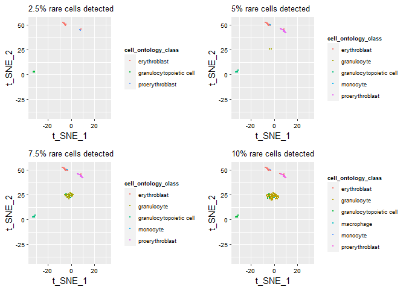
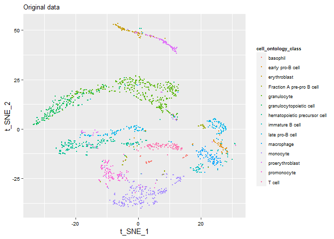
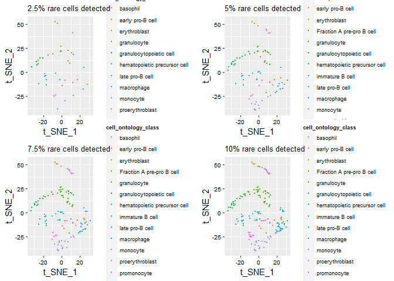

<!-- README.md is generated from README.Rmd. Please edit that file -->

# Brief of scRCD

<!-- badges: start -->
<!-- badges: end -->

The goal of scRCD (Rare Cell Detection of Single-Cell RNA-seq data) is
to calculate the rareness scores for each cell from scRNA-seq data and
selected the desired number of rare cells by the ranks of rareness
scores. scRCD uses a simple and fast spectral clustering-based model to
select the calculate the extent that how “far” each cell is from the
majority cells. The model will be briefly recapped in the following two
subsections.

## Spectral clustering-based optimization

Assume we have a cell-cell affinity matrix $W$ such that the Laplacian
matrix $L$ and degress matrix $\Lambda$ of $W$ can be defined as:

$$
  \Lambda=diag(\boldsymbol{1}^T\cdot W)\\
  L = \Lambda-W
$$

Similar to spectral clustering, if $N$ rare cells are desired, then the
target cells can be obtained by cutting the whole data set into $N+1$
clusters, where $N$ clusters only contain 1 cell and the rest one
cluster contains all the rest cells. This objective can be achieved by
minimizing the sum of edges between clusters:

$$
  \underset{C^*\subset C,\boldsymbol{card}(C^*)=N}{\arg\min}\sum\limits_{c^*\in C^*}E(v_{c^*},V/\{v_{c^*}\})
$$

where $V$ is the collection of nodes representing each cell and $v_{c}$
is the node for cell index$c$, and $E(v_{c},V/\{v_{c}\})$ is the sum of
edges between $v_c$ and the remaining cells. This problem is equivalent
to finding the $N$ smallest elements of the diagonal of the Laplacian
matrix $L$:

$$
\underset{C^*\subset C,\boldsymbol{card}(C^*)=N}{\arg\min}\sum\limits_{c^*\in C^*} L_{c^*,c^*}
$$

The higher $L_{c,c}$ represents the better connection of cell $c$ to the
remaining cells, thus we can obtain the rareness score $S_c$ for cell
$c$ as the opposite of standardized $L_{c,c}$ :

$$
S_c = -\frac{L_{c,c}-\min\limits_{c\in C} L_{c,c}}{\max\limits_{c\in C} L_{c,c}-\min\limits_{c\in C} L_{c,c}}
$$

## Construction of affinity matrix $W$

Here we construct a sparse cell-cell affinity matrix by the following
steps.

First, we randomly uniformly sample anchor cells from the whole data
set, denote $a\in A$.

Then a distance matrix $H$ is obtained such that each element represents
the Euclidean distance between the cell and anchor cells. Let
$\boldsymbol{F}_c$ refers to the feature vector for cell $c$, then the
$H$ formulates as:

$$
  H_{c,a} = d(\boldsymbol{F}_c,\boldsymbol{F}_a)
$$

Thereafter we calculate the minimal distance of cell $c$ between anchor
cells as:

$$
  D_{min,c} = \min_{a\in A,a\neq c}d(\boldsymbol{F}_c,\boldsymbol{F}_a)
$$

Given the $\alpha$, we can calculate the $\alpha$-percentage quantile
for $\{D_{min,c}|c\in C\}$ (we use $\alpha = 0.975$ by default).

$$
  Q = \mbox{the } \alpha \mbox{ percentage quantile of }\{D_{min,c}|c\in C\}
$$

We use $Q$ as a threshold such that the edges with distance from anchor
cells less than $Q$ retain while edges with larger distances vanish to
zeros, in order to preserve the local data structure. For the retained
edges between cell $c$ and the anchor cells, we calculate the edges in a
$k_c$-NN manner ($k_c$ is the number of non-zero distances from cell $c$
in $H$ )$$
  B_{c,a} = \left\{
             \begin{array}{lr}
             (D_{min,c}-H_{c,a})/(k_cD_{min,c}-\sum\limits_{i,H_{c,i}<Q}H_{c,i}) &,  H_{c,a}<Q\\
             0 &,  H_{c,a}\geq Q
             \end{array}
\right. \mbox{   for  } \min\limits_{c}{H_{c,a}}\leq Q
$$

For the cell whose nearest anchor cell is still beyond $D_{min,c}$, we
set the bipartite element between the cell and the nearest anchor cell
as 1, in order to keep the bipartite and affinity matrix complete:$$
  B_{c,a} = \left\{
             \begin{array}{lr}
             1 &,  H_{c,a} = \min\limits_{a}{H_{c,a}}\\
             0 &,  H_{c,a}> \min\limits_{a}{H_{c,a}}
             \end{array}
\right.\quad\mbox{for  } \min\limits_{a}{H_{c,a}}> Q
$$

Consequently we obtained a sparse bipartite, thus finally a sparse
affinity matrix is generated by:$$
  W = BB^T
$$

# Installation

You can install the development version of scRCD like so:

``` r
devtools::install_github("AristoQian/scRCD")
```

# Example

## Computing rareness scores

First we load scRCD and the two attached example data sets :

``` r
library(scRCD)
# gene-barcode matrix
data(marrow)
# cell subtype data
data(cell.type.marrow)
dim(marrow)
#> [1] 23433  1732
dim(cell.type.marrow)
#> [1] 1732    1
```

Then PCA is performed for dimension reduction:

``` r
pc.marrow<-prcomp(t(marrow))
head(pc.marrow$x[,1:25])
#>                        PC1       PC2       PC3         PC4         PC5
#> AAACCTGCAGTAACGG -601.1768 -590.6617 182.66606  -25.701854   44.046817
#> AAACGGGAGACCGGAT -602.1331 -580.5124 262.12038   -1.471796    9.870285
#> AAACGGGAGCGCTCCA -612.9753 -605.2006  31.85770   47.841898   22.103865
#> AAACGGGAGGACGAAA 3414.3846  997.8970 -48.24250   23.098881  -34.680197
#> AAACGGGAGGTACTCT -578.3619 -595.9810   2.90674 -151.322491  157.676989
#> AAACGGGAGGTGCTTT  276.0166 -228.6174 383.94272   12.519259 -316.016664
#>                          PC6        PC7         PC8        PC9     PC10
#> AAACCTGCAGTAACGG   -2.644035   44.18824  -4.7982969 -35.267998 14.70825
#> AAACGGGAGACCGGAT  -39.833536   96.07933   6.6499845   4.946156 15.69352
#> AAACGGGAGCGCTCCA -100.248630   54.29455  15.5242208   7.791896 56.25372
#> AAACGGGAGGACGAAA  -44.771102  -75.24133   0.0399387  -1.048704 76.29648
#> AAACGGGAGGTACTCT  219.636524 -167.44935  21.3667063 -57.972494 14.49212
#> AAACGGGAGGTGCTTT   -5.537145  -96.24719 -13.0631424 -44.300643 48.33228
#>                        PC11        PC12       PC13        PC14       PC15
#> AAACCTGCAGTAACGG -65.963702   0.1966557 -30.472204  99.8617336 -35.678249
#> AAACGGGAGACCGGAT  25.539907  -5.0612602  -9.860888  29.1086550 -46.242166
#> AAACGGGAGCGCTCCA  23.311360 -37.1234968  22.753447  70.2937733 -35.666078
#> AAACGGGAGGACGAAA  34.239600  22.5201641 -15.985305 -13.9511530   2.774235
#> AAACGGGAGGTACTCT  21.095862 -14.8066962 -55.501484  -3.2349343  -6.341012
#> AAACGGGAGGTGCTTT   4.273147   7.0414165 -19.317884  -0.7143309  16.101506
#>                       PC16       PC17       PC18        PC19      PC20
#> AAACCTGCAGTAACGG  90.26033 -11.823889 166.510058 -123.064590 109.77319
#> AAACGGGAGACCGGAT  49.93766  -1.888539   8.999624    4.364571 -55.88624
#> AAACGGGAGCGCTCCA  55.35675 -20.189738  -5.264827   -9.060842 -83.15521
#> AAACGGGAGGACGAAA  28.27457 -67.861792   6.669546   34.765924  50.34191
#> AAACGGGAGGTACTCT  81.41384   5.098922  26.542793   25.689985 -30.41819
#> AAACGGGAGGTGCTTT -33.57180  44.027274  -3.199971   -5.944702 -14.25003
#>                        PC21       PC22       PC23       PC24       PC25
#> AAACCTGCAGTAACGG  -4.376767 -42.484741  34.633172  48.796967 -58.883081
#> AAACGGGAGACCGGAT -17.247456  11.473076 -44.098222  -9.313429  20.812364
#> AAACGGGAGCGCTCCA -30.111656   7.496699 -51.531125  35.010320  14.991085
#> AAACGGGAGGACGAAA -36.480215  10.911691   6.863655  28.082123  -1.857646
#> AAACGGGAGGTACTCT -37.354039  -4.522044 -51.252845 -23.828672 -22.828478
#> AAACGGGAGGTGCTTT  19.723972   3.961795  12.698971 -19.754170   6.512411
```

Top 25 PCs are selected as cell features

scRCD main function is called to compute rareness scores by repeating 10
times:

    #> [1] "The 1-th repeat"
    #> [1] "Constructing affinity matrix"
    #> [1] "Calculating rare cell score for each cell"
    #> [1] "The 2-th repeat"
    #> [1] "Constructing affinity matrix"
    #> [1] "Calculating rare cell score for each cell"
    #> [1] "The 3-th repeat"
    #> [1] "Constructing affinity matrix"
    #> [1] "Calculating rare cell score for each cell"
    #> [1] "The 4-th repeat"
    #> [1] "Constructing affinity matrix"
    #> [1] "Calculating rare cell score for each cell"
    #> [1] "The 5-th repeat"
    #> [1] "Constructing affinity matrix"
    #> [1] "Calculating rare cell score for each cell"
    #> [1] "The 6-th repeat"
    #> [1] "Constructing affinity matrix"
    #> [1] "Calculating rare cell score for each cell"
    #> [1] "The 7-th repeat"
    #> [1] "Constructing affinity matrix"
    #> [1] "Calculating rare cell score for each cell"
    #> [1] "The 8-th repeat"
    #> [1] "Constructing affinity matrix"
    #> [1] "Calculating rare cell score for each cell"
    #> [1] "The 9-th repeat"
    #> [1] "Constructing affinity matrix"
    #> [1] "Calculating rare cell score for each cell"
    #> [1] "The 10-th repeat"
    #> [1] "Constructing affinity matrix"
    #> [1] "Calculating rare cell score for each cell"

## Visualization and comparison to current methods

First, perform t-SNE given the top PCs:

``` r
library(Rtsne)
tsne<- Rtsne(pc.marrow$x[,1:25],pca=F,dims=2,perplexity=30,theta=0.5)
head(tsne$Y)
#>            [,1]       [,2]
#> [1,]  12.571226 -24.541601
#> [2,]  12.447814 -10.632889
#> [3,]   3.732177  -8.250996
#> [4,] -26.728662   7.732878
#> [5,]  -6.345803 -23.878523
#> [6,]   9.235574   9.260185
```

Then we can called the visualization function to compare the rare cells
of different fractions (0.025,0.05,0.075,0.5)

``` r
library(cowplot)
vis<-scRCD.visualize(tsne = tsne, scores = scores, cell.type = cell.type.marrow, frac.list = c(0.025,0.05,0.075,0.1))
#tSNE for the rare cells
plt.rare<-plot_grid(vis$plt.frac.list$`0.025`,vis$plt.frac.list$`0.05`,
               vis$plt.frac.list$`0.075`,vis$plt.frac.list$`0.1`,
               nrow = 2, ncol = 2)
plt.rare
```



``` r
plt.all<-vis$plt.all.cell
plt.all
```



We can also compare our result to, FiRE, another novel method for rare
cell detection:

``` r
library(FiRE)
rnames <- rownames(t(marrow))
cnames <- colnames(t(marrow))

L <- 100 # Number of estimators
M <- 50 # Dims to be sampled

# Model creation without optional parameter
model <- new(FiRE::FiRE, L, M)

## There are 3 more optional parameters they can be passed as
## model <- new(FiRE::FiRE, L, M, H, seed, verbose)
## Hashing all samples
model$fit(as.matrix(t(marrow)))

## Computing score of each sample
scores.fire <- model$score(as.matrix(t(marrow)))

vis.fire<-scRCD.visualize(tsne = tsne, scores = scores.fire, cell.type = cell.type.marrow, frac.list = c(0.025,0.05,0.075,0.1))
plt.rare.fire<-plot_grid(vis.fire$plt.frac.list$`0.025`,
                         vis.fire$plt.frac.list$`0.05`,
                         vis.fire$plt.frac.list$`0.075`,
                         vis.fire$plt.frac.list$`0.1`,
                         nrow = 2, ncol = 2)
plt.rare.fire
```



``` r
plt.all.fire<-vis.fire$plt.all.cell
plt.all.fire
```


"# scRCD" 
